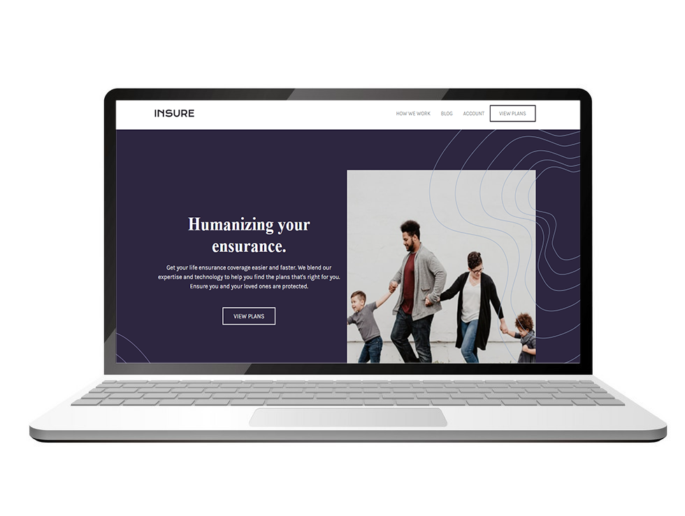
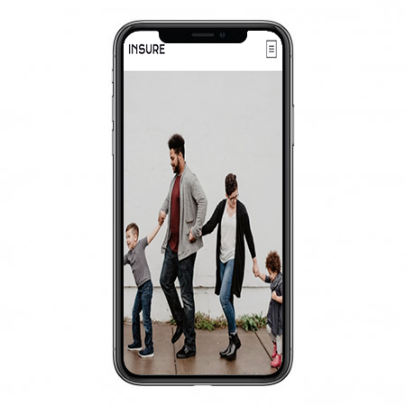

# Frontend Mentor - Insure landing page

## Welcome! 👋

This is a [Frontend Mentor](https://www.frontendmentor.io) challenge.

[Frontend Mentor](https://www.frontendmentor.io) challenges allow you to improve your skills in a real-life workflow.

## The challenge 🚀

Your challenge is to build out this landing page and get it looking as close to the design as possible.

You can use any tools you like to help you complete the challenge. So if you've got something you'd like to practice, feel free to give it a go.

Your users should be able to:

- View the optimal layout for the site depending on their device's screen size.
- See hover states for all interactive elements on the page.

You can see the design and download all project's files [here](https://www.frontendmentor.io/challenges/insure-landing-page-uTU68JV8).

Project URL: https://insure-landing-page-washington.vercel.app

***

Made with ❤️ by [Washington Campos](https://github.com/washington299).